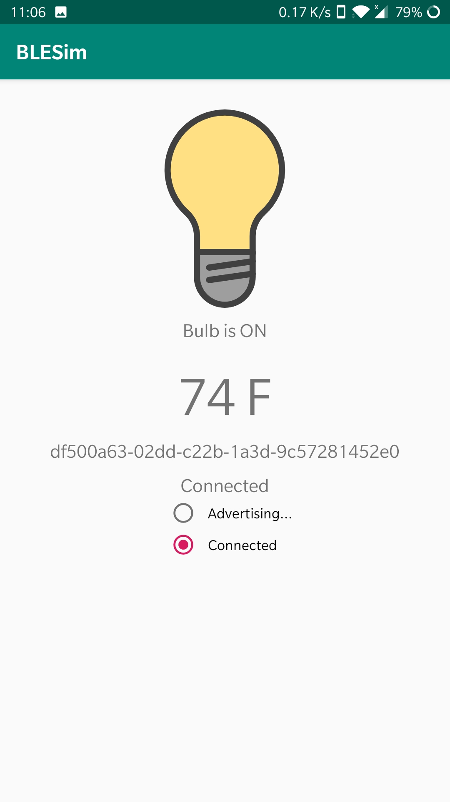
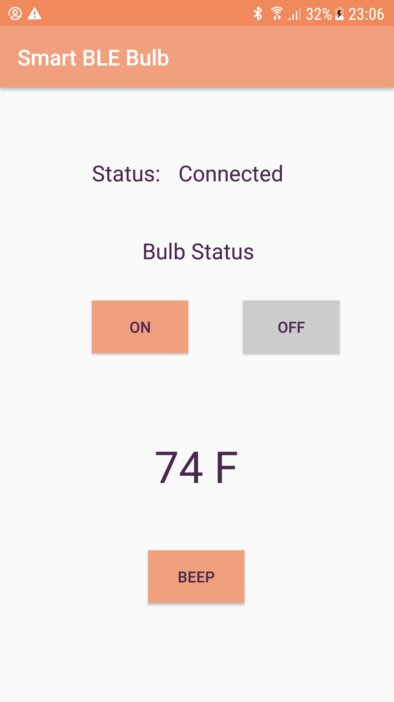

# Smart Bluetooth Low Energy Bulb

This app enables user to communicate with a Smart BLE bulb that is also capable of beeping and measuring temperature.

Bulb Screen             |Application Screen             |
:-------------------------:|:-------------------------:
  |   
